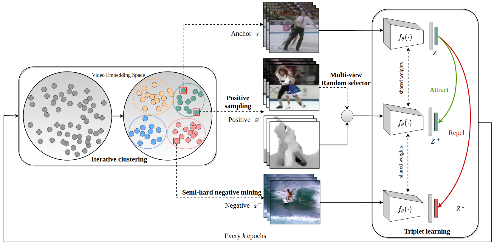

# SLIC: Self-Supervised Learning with Iterative Clustering for Human Action Videos [CVPR 2022]

[](https://paperswithcode.com/sota/self-supervised-video-retrieval-on-ucf101?p=slic-self-supervised-learning-with-iterative-1)
[](https://paperswithcode.com/sota/self-supervised-video-retrieval-on-hmdb51?p=slic-self-supervised-learning-with-iterative-1)

Official code repo for [SLIC: Self-Supervised Learning with Iterative Clustering for Human Action Videos](https://arxiv.org/abs/2206.12534).



## Link:
[[Project Page]](https://rvl.cs.toronto.edu/video-similarity/) [[Arxiv]](https://arxiv.org/abs/2206.12534)

## Environment Setup
```
pip install -r requirements.txt
```


## Dataset
For pre-training, we follow the instructions on [this repo](https://github.com/kenshohara/3D-ResNets-PyTorch) to install and pre-process UCF101, HMDB51, and Kinetics400.

For fine-tuning, we download the LMDB version for UCF101 from the following links:
* UCF101
  * RGB:  [LMDB](http://thor.robots.ox.ac.uk/~vgg/data/CoCLR/ucf101_rgb_lmdb.tar)
  * TVL1 Optical Flow: [LMDB](http://thor.robots.ox.ac.uk/~vgg/data/CoCLR/ucf101_flow_lmdb.tar)

## Pretrain
* ResNet-18 pretrain on UCF-RGB & Optical Flow with Iterative Clustering and Temporal Discrimination Loss
 
```
python online_train.py --cfg config/custom_configs/resnet_ucf_itercluster_flow.yaml \
--gpu 0,1 --batch_size 32 --output ./output/path --iterative_cluster
```

* ResNet-18 pretrain on Kinetics-RGB & Optical Flow with Iterative Clustering and Temporal Discrimination Loss
 
```
python online_train.py --cfg config/custom_configs/resnet_kin_itercluster_flow.yaml \
--gpu 0,1,2,3,4,5,6,7 --batch_size 104 --output ./output/path --iterative_cluster
```

## Finetune (Adapted from CoCLR)

* end-to-end finetune
```
python coclr_classify.py --cfg config/custom_configs/resnet_ucf_itercluster_flow.yaml \
--train_what ft --epochs 150 --schedule 60 100 --pretrain/resume /pth/to/ckpt.pth.tar --gpu 0 
```
* linear probe
```
python coclr_classify.py --cfg config/custom_configs/resnet_ucf_itercluster_flow.yaml \
--train_what last --epochs 150 --schedule 60 100 --pretrain/resume /pth/to/ckpt.pth.tar --gpu 0
```
* test
```
python coclr_classify.py --cfg config/custom_configs/resnet_ucf_itercluster_flow.yaml \
--train_what ft --checkpoint_path /pth/to/ckpt.pth.tar --ten_crop --gpu 0
```

## Evaluate retrieval (Adapted from IIC)

```
python iic_retrieve_clips.py --checkpoint_path /pth/to/ckpt.pth.tar --cfg config/custom_configs/resnet_ucf_itercluster_flow.yaml --gpu 0 --feature_dir eval_output --dataset ucf101
```


